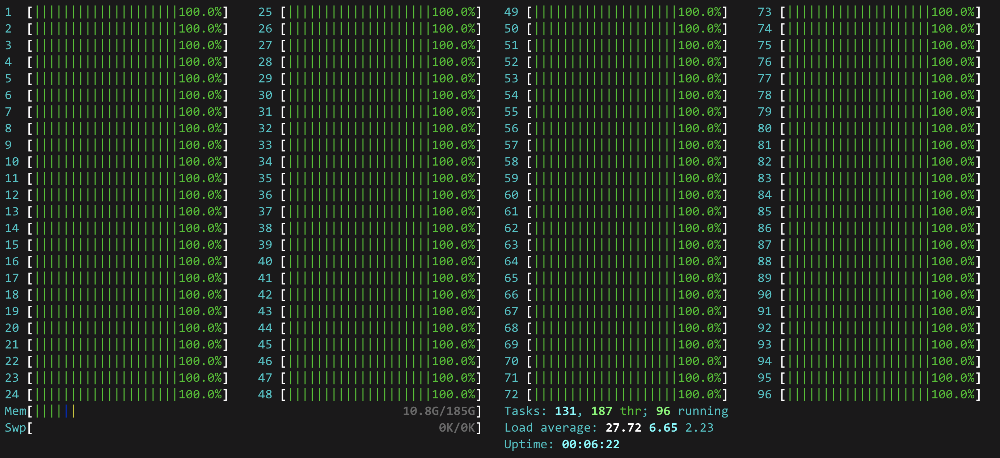

# aws-graviton

AWS instances based on [Graviton2 processors](https://aws.amazon.com/ec2/graviton/) outperform the Xeon based at a fraction of the cost. These are ARM processors so the software stack has to be built for this architecture. 

|  |
|:--:|
| *AWS c6gd.16xlarge Graviton2 instance with 64 vcore* |

|  |
|:--:|
| **AWS c5.24xlarge Xeon instance with 96 vcore** |

Here there is a collection of wheels already build for Ubuntu 20.04 arm64:

## Graviton2 vs. Xeon performance
Benchmark of 2700 simulations of a backtest trading strategy.

AWS instance | vCore | Cost $/hour | Wall time | Arch
------------ | ------------- | -- |--  | --
c6gd.16xlarge | 64 | 2.4 | 12m53s  | aarch64 (ARM)
c5.24xlarge  | 96 | 4.08 | 13m17s | x86
m5.8xlarge | 32 | 1.53 | 32m20s  | x86
z1.12xlarge | 24 | 2.2 | 43m03s | x86
Mac mini M1 (*) | 8 | - | 80m00s | arm64 (ARM)

(*) Just for fun I have included the benchmark using a Mac mini with the amazingly fast new Apple Silicon chips. In fact it is the fastest per core.

## Ray
[Starting point to build Ray from source in Ubuntu arm64 20.04](https://github.com/ray-project/ray/issues/13780)

[ray-1.2.0-cp38-cp38-linux_aarch64.whl](ray-1.2.0-cp38-cp38-linux_aarch64.whl)
